Feature Selection/EDA
---
#### Motivation
To better understand the relationship between individual features and the target variable (RPM/BPM Blend), we utilized three main techniques. First, to determine the strength of the relationship between each feature and the target we examined the correlation between the two. We also looked at the full correlation matrix to uncover potential collinearity. Second, we used permutation importance to gain a better understanding of how important a feature was in predicting the target variable. Lastly, we looked at partial dependence plots to uncover the shape and direction of the relationship. The following provides a brief overview of the work. For brevity, we've only included EDA on the box-score feature subset, which includes per-100 possession and advance metrics, for the '+1Season' model below although we followed this same approach for each model and feature subset.

#### Correlation Table
The following table contains the rank order of features based on the strength of their relationship with the target variable as represented by both the pearson and spearman correlation. Unsurprisingly, `BPM`, and `VORP` which is a function of `BPM`, has the strongest relationship with the +1 `BPM/RPM` blend.  Other advanced metrics that aim to represent many of the box score statistics in one metric are also at the top of the list exemplifying their utility.

Free throws (`PER100_FT` and `PER100_FTA`) appear near the top of the list as do various shooting metrics (`TS%` and `PER100_FG%`). Surprisingly, three-point shooting metrics fall near the bottom of the list (`3PA_RATE`, `PER100_3PA`, `PER100_3P%`, and `PER100_3P`).

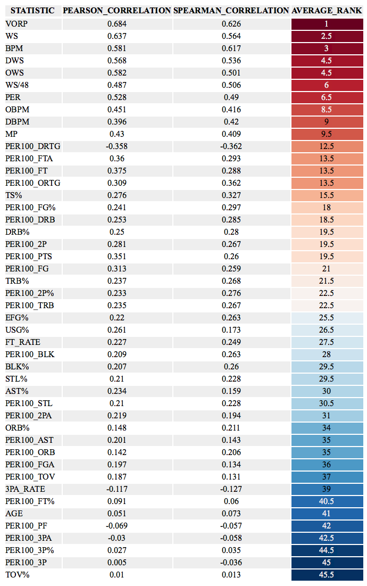

#### Correlation Matrix
Keeping in mind that many of the box-score statistics listed above are highly correlated we looked at the correlation matrix of both per 100 possession features and advanced features. A few worthy notes:

* `PER` an all-encompassing statistic that is often sited publicly but lost favor in basketball analytics community over the years shows one of it's major deficiencies in not being related to defensive production as illustrated by its limited correlation with `DBPM` and `DWS`.
* Relatedly, defensive metrics based on box-score data remain limited at best. `DBPM` and `DWS` are only slightly correlated.
* `PER100_ORB` and `PER100_3PA` has the strongest negative relationship, which makes intuitive sense, but as the game changes with more players possessing the physical characteristics to rebound at a high-level and the skill to shoot threes efficiently it will be interesting to see if this changes.

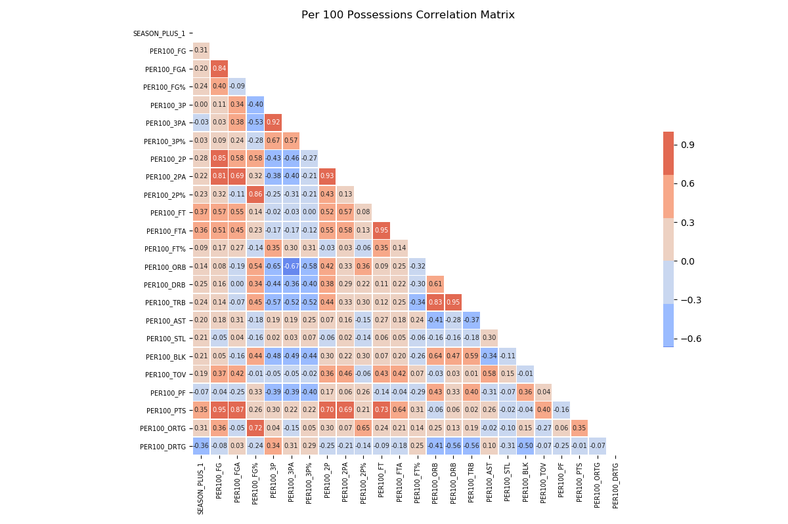

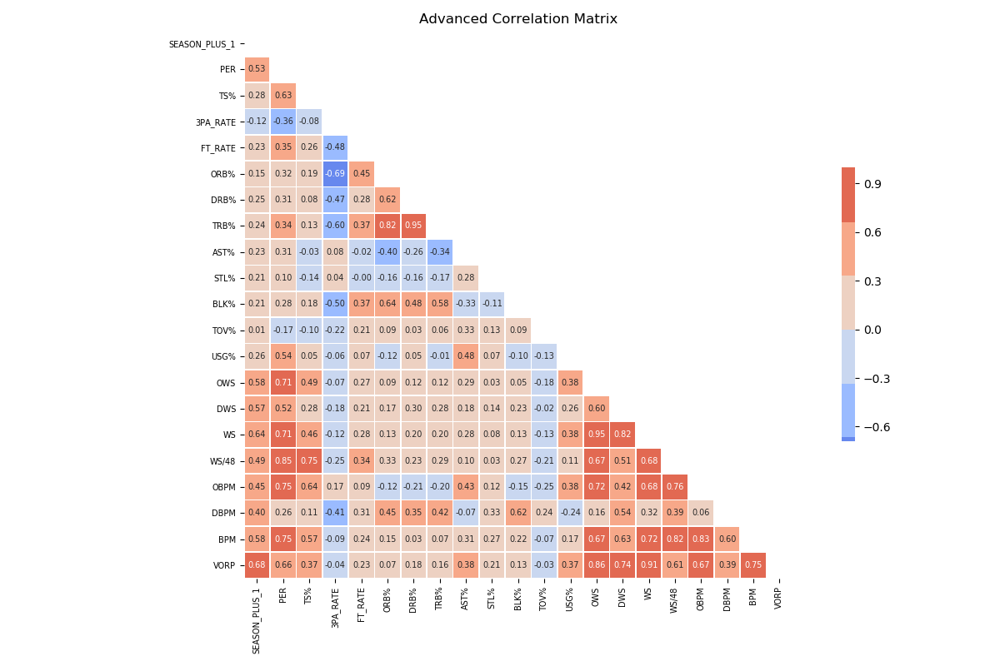

#### Permutation Importance
[Permutation Importance](https://explained.ai/rf-importance/) involves the fitting of a baseline model and then rescoring that model after randomly shuffling each individual feature. In theory, a predictive feature that is shuffled will have a large increase in the model's error metric, while a less predictive feature will return a similar error metric as the baseline model.

The first attempt included all advanced metrics, which overwhelmed most of the traditional box-score statistics. `BPM` and `VORP` stand out as being the most predictive, which makes intuitive sense since they encompass many of the individual box score statistics. Features that are highly-correlated with those advanced metrics appear as non-predictive. A column of random numbers `RANDOM` was included in the baseline model as a threshold of where features begin to add noise. Those features that fall below the `RANDOM` feature do not add any additional information to the model. We see that the majority of metrics fall below this threshold.

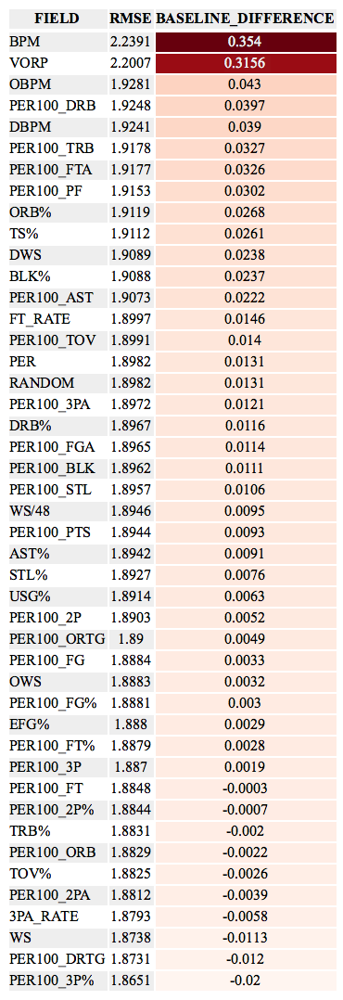

In the second attempt we removed all advanced metrics to gain more interpretability into which specific features were most predictive of our target variable. The `RANDOM` column that acts as a threshold between predictive and unpredictive features now falls at the bottom of the list. By dropping the advance metrics all of the traditional box score metrics are now adding information to the model.

In addition to `ORTG` and `DRTG` we again see `PER100_FT` at the top of the list.  Unlike the correlation approach we do see a three-point metric near the top of the list (`PER100_3PA`). Statistics involving blocks (`PER100_BLK` and `BLK%`) also appear higher in the premutation approach as compared to raw correlations. Rebounding metrics continue to remain somewhere in the middle.

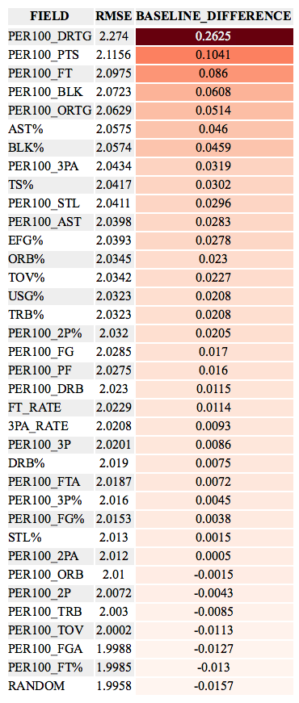

#### Partial Dependence Plots
[Partial Dependence plots](https://christophm.github.io/interpretable-ml-book/pdp.html) visualize the shape of the relationship between a target and a feature. This allows us to better understand whether a feature has a linear, monotonic, or more complex relationship with the target and the direction of that relationship.

As three simple examples, `eFG%`, `TS%`, and `MP` each have a relatively positive linear relationship with our target. The more minutes you play and the better you shoot, the higher your BPM/RPM will be the following season.

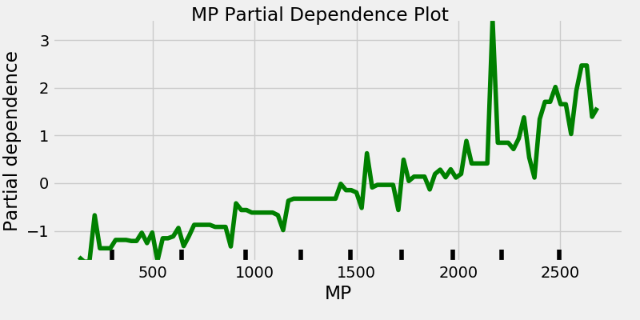
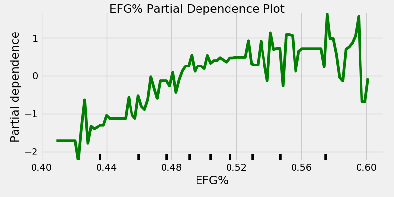
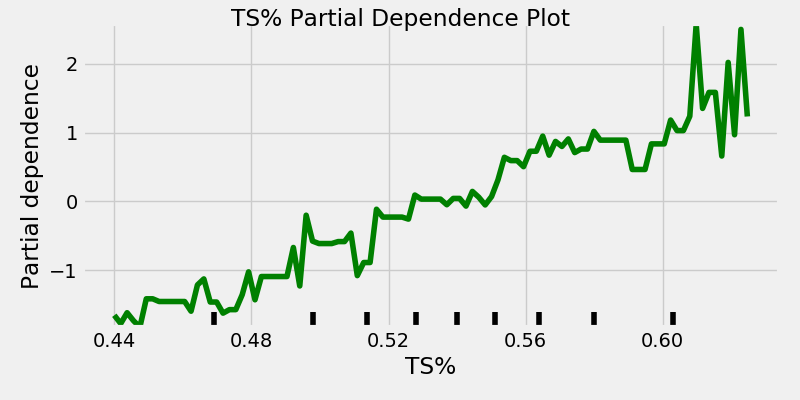

Free throws appeared as highly predictive in both the correlation and permutation importance tables. We see that `FT_RATE` and `PER100_FTA` each have a positive linear relationship with the target variable. One major takeaway from this entire exercise is how important the ability to get to the free throw line is

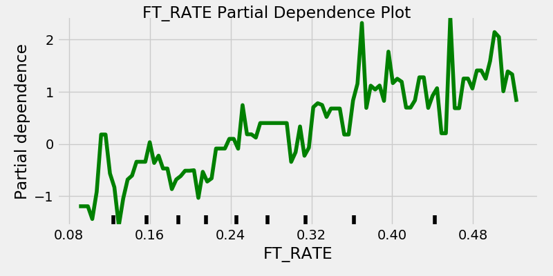
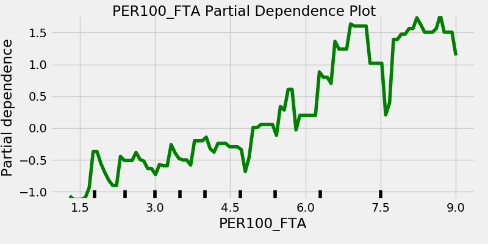

Surprisingly, the rate at which a player generates threes is not as clear as expected. While three-point shooting is highly predictive at the team level it appears it is more nuanced at the player level .

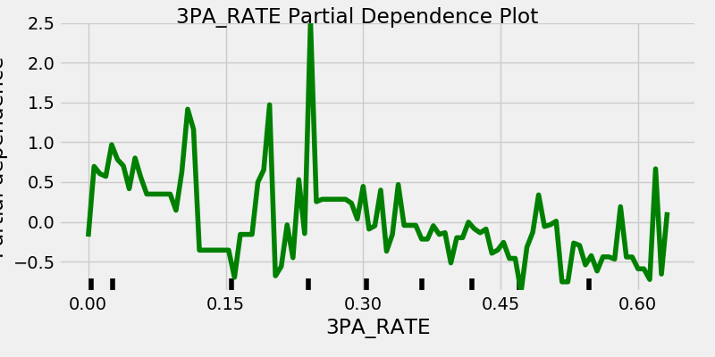
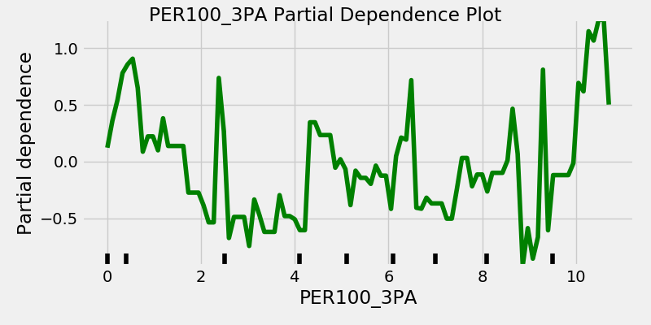

Since we haven't put any minutes filters on our input data many of the following plots will have noisy tails. Some players with few minutes will record outlier statistics that will influence the ends of these plots. However, the middle of each tells an interesting story. For `PER100_AST`, `PER100_BLK`, `PER100_DRB`, and `PER100_ORB` there appears to be diminishing returns once a player reaches a certain threshold. From a roster construction standpoint this is interesting as players who record values above these thresholds won't provide as much value as teams might expect.

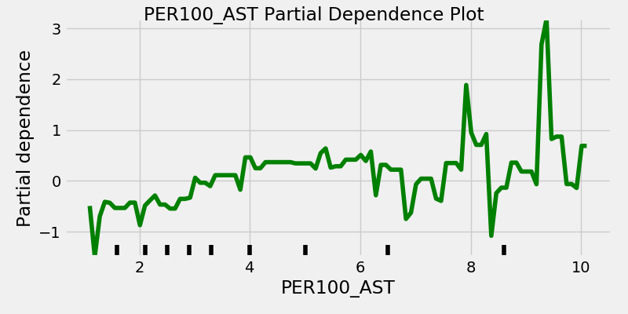
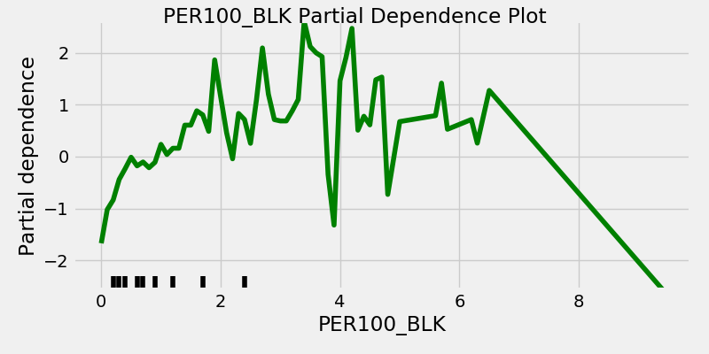
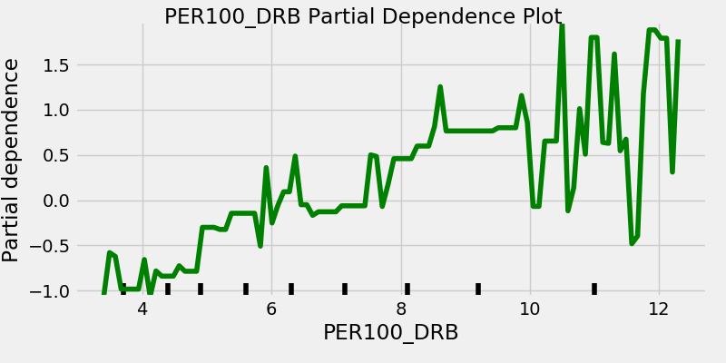
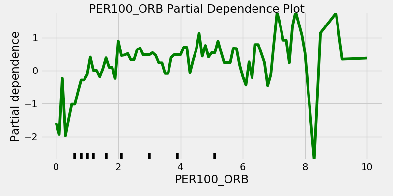

`USG%` is quite interesting as it appears to be non-predictive up until a player reaches 20%, which is the average assuming all five players share possessions equally. Above that point it has a linear relationship.

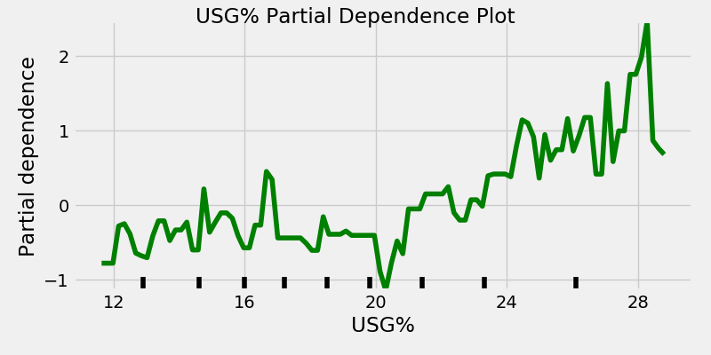

Combining all of the metrics above plus `PER100_ORTG`, `PER100_DRTG`, and `PER100_STL` in one model we observe similar trends. Shooting numbers appear less predictive as other metrics. Free throw attempts and assists make a huge jump in importance after a certain threshold. Blocks and rebounds are useful until a certain number at which point there are diminishing returns.
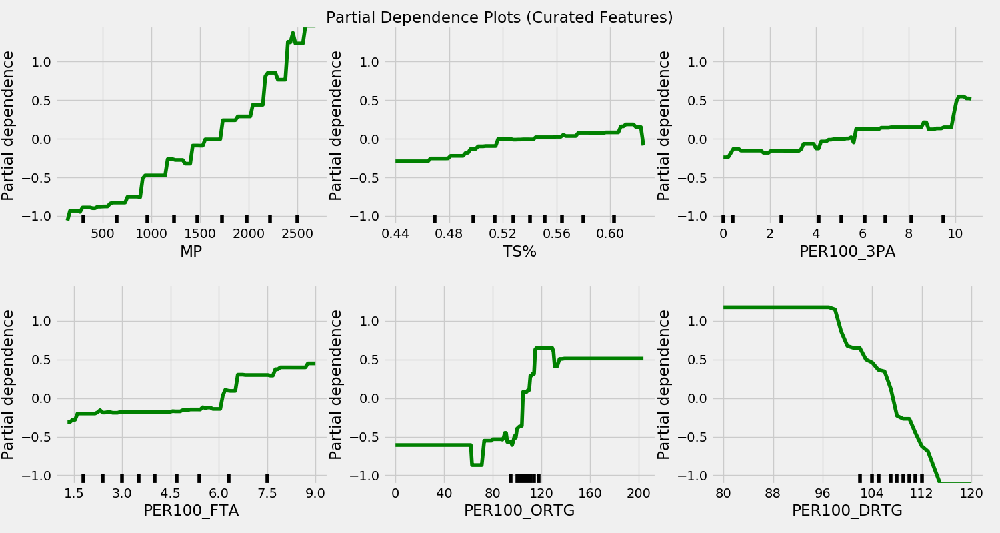
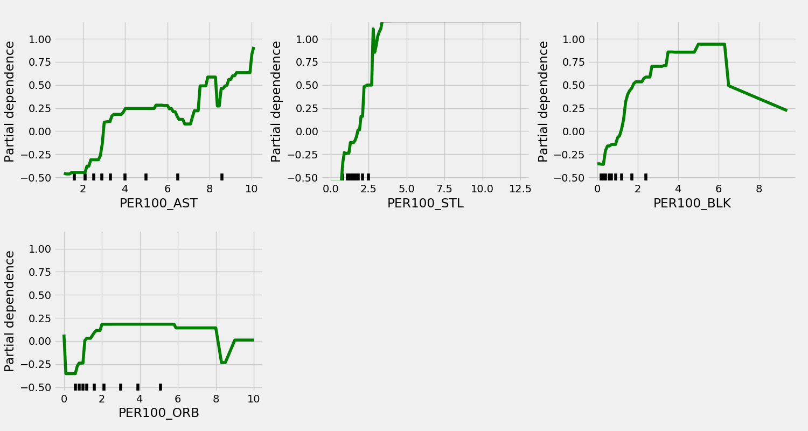

#### Summary
All-encompassing advanced metrics are highly predictive. Free throws are incredibly important, much more so than threes. Other traditional box-score statistics such as assists, steals, blocks, and rebounds are predictive up until a certain threshold and then fall victim to diminishing returns. While shooting numbers are linearly related to the target they are not as strong of predictors as many of the field goal and three-point attempts metrics.
