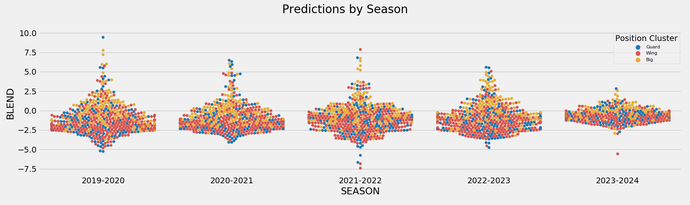

Modeling
---
#### Motivation
Having engineered an input dataset containing on-court metrics, player measurements, positional estimates, and salary information we now evaluate potential algorithms to use in our final models. Once we've selected a list of candidate algorithms we'll then build a pipeline to gridsearch over various algorithms, parameters, and predictor subsets to optimize our 'Season+1' through 'Season+5' models. Lastly, we'll examine model performance and look at predictions for the upcoming 2019-2020 season.

#### Model Selection
To gain a better understanding of what algorithms might best fit our data, we'll use the `box-score` predictors subset, containing per-100 possession and advanced metrics, to predict a player's RPM/BPM blend one season into the future. This 'Season+1' model will serve as a baseline for how we might expect the candidate algorithms to perform using other predictor subsets on our 'Season+1' through 'Season+5' models. This will aid in winnowing down the list of potential algorithms to gridsearch over in our final modeling step, drastically cutting down on computation time.

After performing a 75/25 train/test split and scaling the data, we performed a 10-fold cross validation on seven candidate algorithms. Using default parameters for sklearn's implementation of Ridge, Lasso, Elastic Net, Random Forest, and Gradient Boosting algorithms along with XGBoost and CatBoost, we observed the following RMSE scores.

Of the regularized regression model types, Ridge far outperforms Lasso and Elastic Net. CatBoost performs best overall but only slightly better than the other boosting algorithms. Keeping in mind the computational resources required to train both the XGBoost and CatBoost algorithms we've decided to exclude them from our final gridsearch process as sklearn's Gradient Boosting implementation appears to perform only slightly worse.

For exploratory purposes, as this won't serve as our final model, we tuned and re-fit the ridge regression above to gain a sense of how our observations in the exploratory data analysis step align with the models' feature importances.

As we found in the feature selection phase of the project many of the 'all-encompassing' box-score metrics, `VORP` and `BPM` in particular, are most predictive. Steal metrics (`PER100_STL` and `STL%`) show up higher in importance in the ridge model while free throw metrics (`PER100_FT`, `PER100_FTA`, and `FT_RATE`) all appeared lower. `AGE` appeared slightly higher as did `PER100_3PA`. `USG%` and `MP` again were not as high as the casual observer might expect.

#### Final Models
To build our 'Season+1' through 'Season+5' models, we created an sklearn pipeline allowing us to gridsearch over various algorithms, hyperparameters, and predictor subsets for each respective model. The list of potential algorithms and predictor subsets are listed below.

**Candidate Algorithms**
1. Ridge Regression
2. Lasso Regression
3. Elastic Net Regression
4. Random Forest
5. Gradient Boosting

**Feature Subsets**
1. Box-Score: Single-Season Per-100 Possession and Advanced Metrics
2. Three-Season Weighted-Average Box-Score: Three-season weighted averages for Per-100 Possession and Advanced Metrics
3. League Percentiles: Single-season percentile of a player's performance in a given metric compared to the entire league
4. Three-Season Weighted-Average League Percentiles: Three-season weighted average percentile of a player's performance in a given metric compared to the entire league
5. Position Percentiles: Single-season percentile of a player's performance in a given metric compared to the player's advanced cluster position (Guard, Wing, Big)
6. Three-Season Weighted-Average Position Percentiles: Three-season weighted average percentile of a player's performance in a given metric compared to the player's advanced cluster position (Guard, Wing, Big)

The pipeline gridsearch selects the best combination of algorithm, hyperparameters, and predictor subset for each model 'Season+1' through 'Season+5' based on a 5-fold cross validation process to minimize MSE. Below are the results from this process with RMSE listed instead of MSE as it in the same unit measurement as the target variable and is thus easier to interpret. For reference, the BPM/RPM blend we used as our target variable ranged from -9.87 to 9.84 in our training set.

Season+1 through Season+3 performed best with the three-season weighted-average box-score data, while the Season+4 and Season+5 performed best with the single-season box-score data. The mix of algorithms seems somewhat sporadic with Ridge Regression performing best for the Season +1 and Season+3 models, Gradient Boosting performing best for Season+2 and Season+4 models, and ElasticNet performing best for Season+5 model.

#### 2019-2020 Predictions
The final predictions for all seasons, including the 2019-2020 season, can be found in `predictions/predictions.csv`. A quick look at the top and bottom-25 players in our predictions for the 2019-2020 season broadly align with general consensus. Reigning MVP, Giannis Antetokounmpo, along with 2018-2019 First-Team All-NBA members Nikola Jokic and James Harden appear at the top of the list. At the other end of the spectrum we see a few second-year players, Kevin Knox and Collin Sexton, that recorded historically poor performances in 2018-2019 who are again projected to struggle.

From a positional viewpoint, we see that bigs will have the highest average value over the next five seasons. This aligns with what the league has experienced in the last few seasons where the replacement level for bigs has been much higher than for guards and wings.

Similarly, the top of the league will be dominated by bigs, primarily Anthony Davis, Karl-Anthony Towns, Giannis Antetokounmpo, and Nikola Jokic over the same time frame. As we see below, bigs and guards make up the majority of the top quartile of the predictions in each of the next five seasons. It appears the positional scarcity of high-end wings will continue into the near future. 

#### Next Steps
Improve upon the existing models by filtering the training set to a more representative subset of players. This could include some minutes threshold or years of service. An alternative approach would be to build separate models for each advance cluster position (Guard, Wing, Big) to see if that improves predictions.
