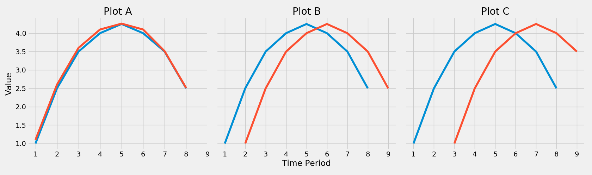
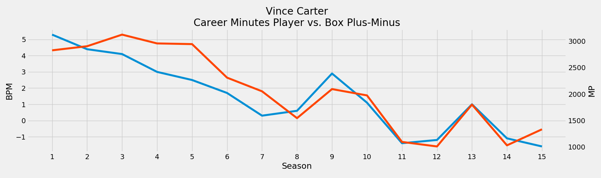
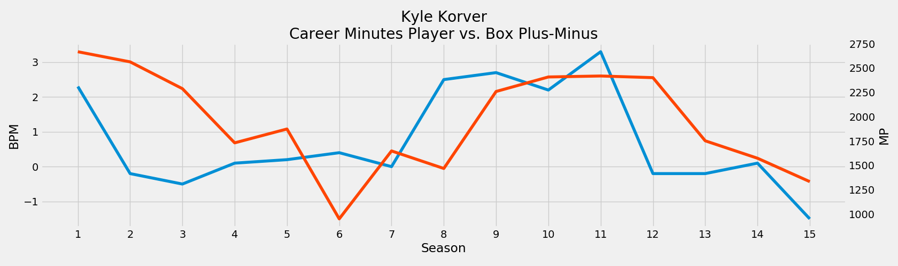
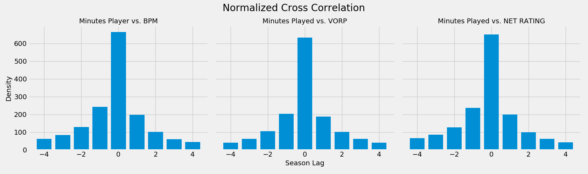
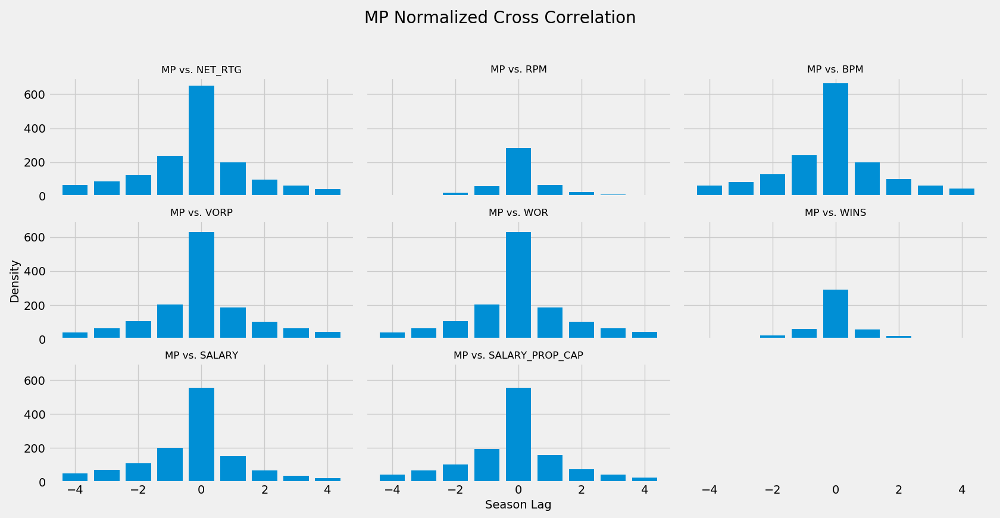
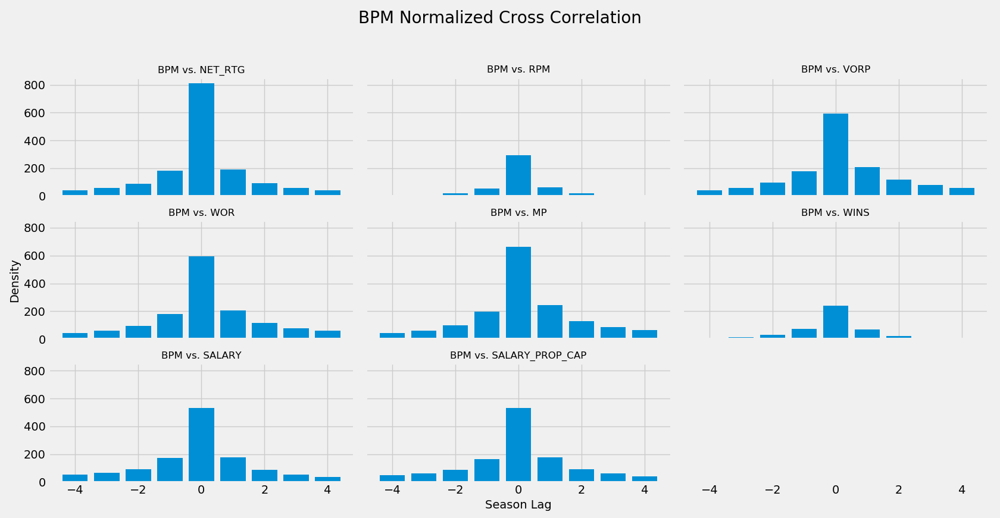
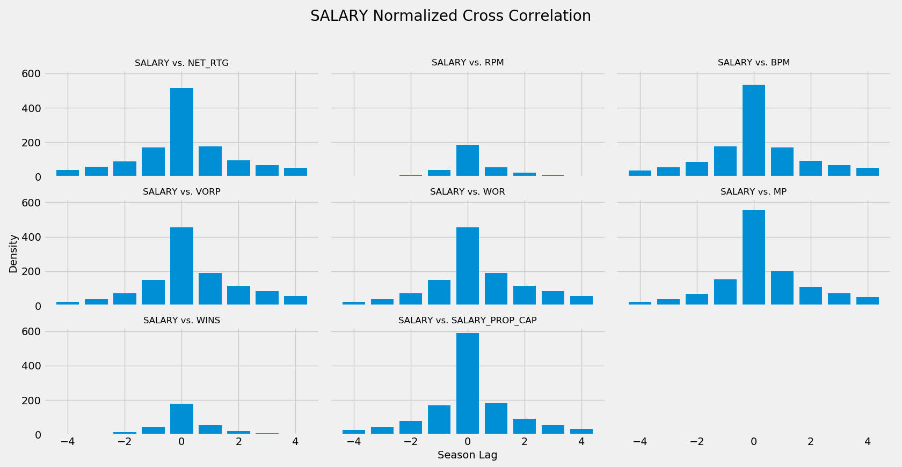
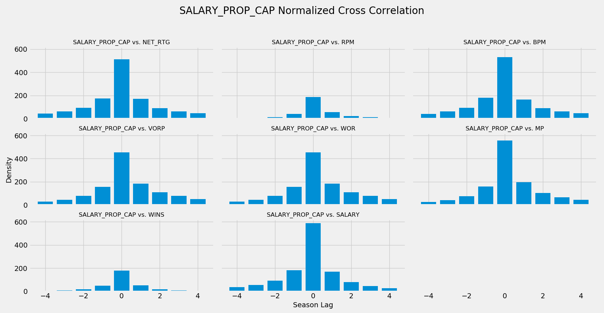

# Target Selection
---
#### Motivation
In preparation for building a player projection model, we sought to identify a metric that represented a player's 'value' at the season level that was a leading indicator of the player's future performance in subsequent seasons. This leading indicator would serve as our target variable when attempting to build a model that would effectively predict future performance. To determine which metric was the best leading indicator we calculated the pairwise cross-correlation of Box Plus-Minus (BPM), Real Plus-Minus (RPM), Net Rating, Wins (RPM Wins), VORP (Value Over Replacement Player), and WOR (Wins Over Replacement) for all players since the 2004-2005 season to determine the seasonal-lead (or lag) between the two metrics. The distribution of these seasonal-leads across all players provides evidence of which metrics lead or lag others.

After examining the resulting distributions of all pairwise metric comparisons, we determined that BPM and/or RPM are the best target variable candidates for our player projection modeling. Each lead all other metrics mentioned above and do so consistently when this process was repeated using only those players that met the starter-criteria (>2000 MP), met a fringe-player criteria (>500 MP), or played since the 2013-2014 season (when RPM first became available). This finding coincides with that of the [538 Player Projection model](https://fivethirtyeight.com/methodology/how-our-nba-predictions-work/), one of the most prevalent public models, which uses a blend of BPM and RPM as its target variable. With this finding, we too used a 1/3 BPM 2/3 RPM blend as our target variable.

The following documentation describes our data sources, methodology, and additional findings which will later influence our player projection model.

---
#### Methodology
In an attempt to quantify the lead or lag between two metrics, we utilized
[Cross-Correlation](https://en.wikipedia.org/wiki/Cross-correlation), a measure of similarity between two time series. By artificially sliding one of the time series across the other, through a process called [convolution](https://docs.scipy.org/doc/numpy/reference/generated/numpy.correlate.html), we are able to calculate the correlation of two time series at different lags. From this we can determine at which lag the two series are most correlated.

Should two metrics move in perfect synchrony, they will be most correlated at a lag of 0. If instead one metric lags another by 1 time period, the two metrics will be most correlated with a lag of 1.

To exemplify this let's examine the plots below. Plot A illustrates two time series that move together without any lead or lag. During the convolution process as one time series is slid over the other they will be most correlated at a lag of 0. Alternatively, in Plot B we observe a lag of one period between the two time series. During the same convolution process these two time series will be most correlated at a lag of 1 time period. Lastly, in Plot C we see a lag of two time periods, which will result in the two time series being most correlated at a lag of 2 during the convolution process.

In practice, the relationship between any two of the metrics in our dataset are not as simple as implied above. However, they still provide insight into which metrics lead or lag others. At the player-level we can illustrate this by comparing the relationship between Minutes Played and Box Plus-Minus over a player's career. Below, we see that MP lagged BPM for the first decade of Vince Carter's career. As his BPM (blue time series) decreased from his rookie year to his seventh season, his total minutes played (red time series) also decreased but not simultaneously. However, after his trade to New Jersey, his increased on-court performance was followed by an increase in minutes in subsequent seasons. Through the cross-correlation process described above we would calculate that these two time series are most correlated at a lag of one season, suggesting MP lags BPM by one season.

A second example, shows the career arc of the same metrics for Kyle Korver. As Korver begins to hit his peak BPM (blue time series) between seasons 8-11, his peak MP (red time series) lags behind from seasons 9-12. Again, we would see a lag of 1 season between MP and BPM.

When this process is extrapolated to all players, we can build a histogram of lags to determine if the relationship observed above holds true across the league. We see below in the left plot, that based on the right-skewed distribution, MP does in fact lag BPM. There are more players with career arcs that exhibit a relationship where MP lags BPM than the inverse. This lagging relationship MP has with BPM also holds true with VORP and Net Rating, although not as strong. MP lags behind three of our metrics in question.

One subtle point, is that the plots above are not plotting the absolute lag but instead the normalized correlation at each lag. This means that if two metrics moved in perfect synchrony, the distribution would be perfectly normal. If instead, one metric leads another the distribution will be skewed in either direction.

When run in a pairwise-fashion between all metrics we can see whether a metric in question leads or lags all other metrics. Using Minutes Played (MP) as an example, below we see that MP lags all major box-score metrics indicating that a player's future minute total lags behind his current on-court performance. This makes intuitive sense as players who play well are subsequently rewarded with more minutes the following season and those who under-perform see their minutes played decrease.

After reviewing all pairwise comparisons we observed that BPM leads all other on-court metrics, and salary which we will discuss later, as evidenced below. RPM exhibits the same relationship with all metrics and is about equal with BPM thus leading to our final decision of blending the two as our final target variable.

One question we had during this process was if these findings held true across smaller subsets of the data. We ran this same analysis using only players that met the NBA-defined starter criteria of 2,000+ MP in addition to a self-defined fringe-player criteria of 500+ MP and observed the same results. Similarly, we were curious if the findings would hold true if the data was limited to only those seasons since 2013 when RPM was first introduced and in fact we did see similar results but less drastic. It appears that RPM and BPM are quite similar, which may provide an explanation of why 538's model uses a blend of the two.

---
#### Additional Findings
We were able to show that MP lags the majority of major box-score metrics. We were also curious if salary payouts would do the same. This might answer the question of if players are paid for future or historical performance. Using this same process we looked at Salary (raw dollar amount) and Salary Cap Prop (the proportion of the league salary cap) each of which told the same story. Salary is a leading indicator of most box-score metrics, with the exception of BPM, in addition to MP. This suggests that teams on average are correctly paying players for future performance.

---
#### Data
BPM, VORP, WOR, and Net Rating, in addition to salary data, were scraped from Basketball-Reference, while RPM and Wins were scraped from ESPN.
