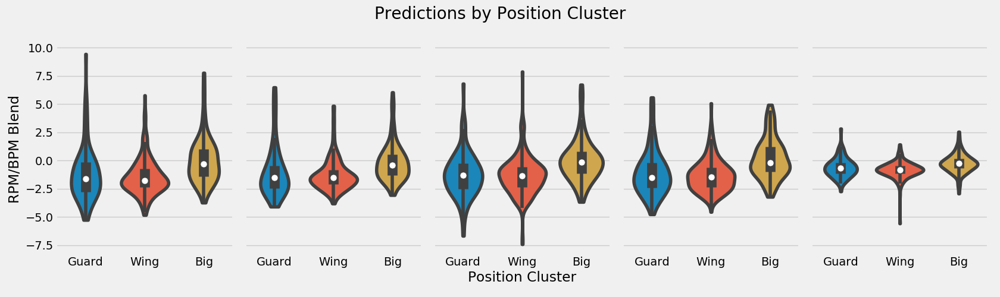
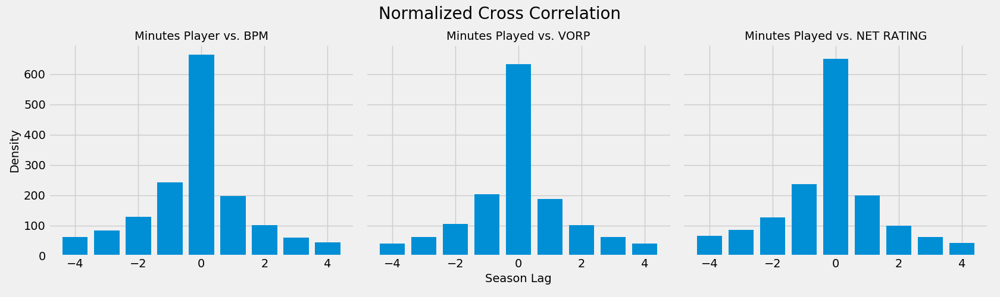
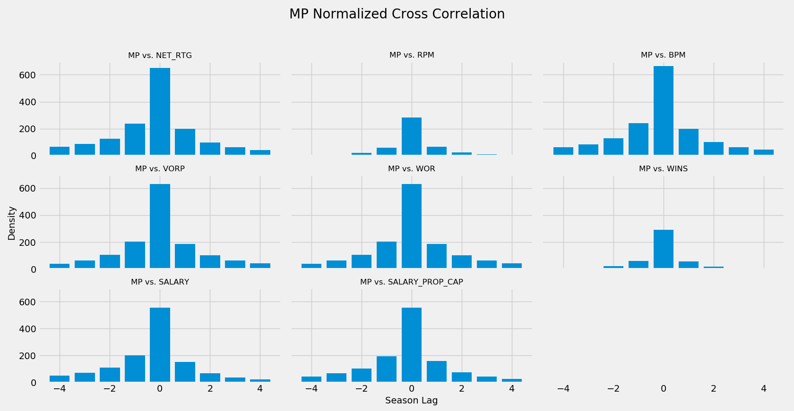
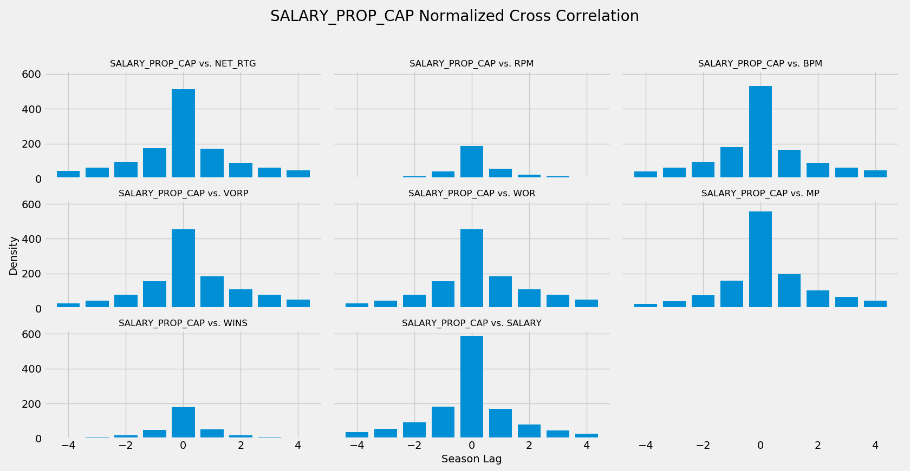
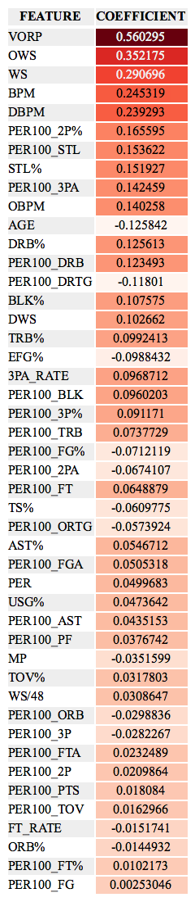
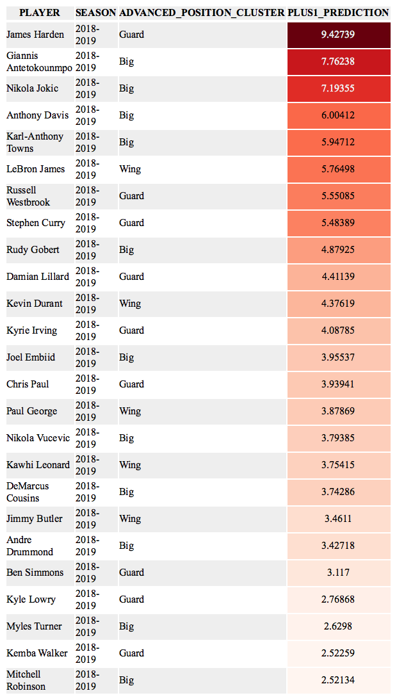

 <h1>NBA Player Projection Model</h1> 

 <h3>September 2020</h3> 

---

### Motivation
To aid in player evaluation and roster construction decisions we sought to build a player projection system providing insight into the expected career trajectory of a player. This suite of models predicts a player's performance one to five seasons into the future based on the player's on-court metrics, physical measurements, positional estimates, and salary information. By better understanding where a team's own player may be heading developmentally, a team may better allocate monetary and player development resources. Teams may also use this information to evaluate external players, whom they may acquire via trade or free agency, in determining a player's future performance and salary earnings.

The following documentation covers our methodology and findings. Our complete predictions can be found in `model/modeling/predictions/predictions.csv`.

### Results
We projected the future on-court performance, a blend of Real Plus-Minus and Box Plus-Minus, of each player from the 2018-2019 NBA seasons five seasons into the future. An example of those projections along with actuals from the previous six seasons for LeBron James can be found below.

A quick look at the top-10 projected players for the upcoming 2019-2020 season sees reigning MVP, Giannis Antetokounmpo, along with 2018-2019 First-Team All-NBA members Nikola Jokic and James Harden at the top of the list.

From a positional viewpoint, we see that bigs will have the highest average value over the next five seasons. This aligns with what the league has experienced in the last few seasons where the replacement level for bigs has been much higher than for guards and wings.

Similarly, the top of the league will be dominated by bigs, primarily Anthony Davis, Karl-Anthony Towns, Giannis Antetokounmpo, and Nikola Jokic over the same time frame. As we see below, bigs and guards make up the majority of the top quartile of the predictions in each of the next five seasons. It appears the positional scarcity of high-end wings will continue into the near future.

From a model performance standpoint, our projections are made from five individual models each projecting out one to five seasons in advance, respectively. Each was fit using a 5-fold cross validation gridsearch process to optimize the model type, predictor subset, and hyperparameters. The test RMSE ranges from 1.89 for the Season+1 model to 2.23 for the Season+5 model. For reference, the RPM/BPM blend we are predicting ranges from -9.87 to 9.84 in our training set, which contains all players since the 2013-2014 season.

### Table of Contents
1. [Target Selection](#target-selection)
2. [Feature Engineering](#feature-engineering)
3. [Feature Selection/EDA](#feature-selection)
4. [Modeling](#modeling)
5. [Next Steps](#next-steps)
6. [References](#references)

---
## Target Selection
In preparation for building a player projection model, we sought to identify a metric that represented a player's 'value' at the season level that was a leading indicator of the player's future performance in subsequent seasons. This leading indicator would serve as our target variable when attempting to build a model that would effectively predict future performance. To determine which metric was the best leading indicator we calculated the pairwise cross-correlation of Box Plus-Minus (BPM), Real Plus-Minus (RPM), Net Rating, Wins (RPM Wins), VORP (Value Over Replacement Player), and WOR (Wins Over Replacement) for all players since the 2004-2005 season to determine the seasonal-lead (or lag) between the two metrics. The distribution of these seasonal-leads across all players provides evidence of which metrics lead or lag others.

After examining the resulting distributions of all pairwise metric comparisons, we determined that BPM and/or RPM are the best target variable candidates for our player projection modeling. Each lead all other metrics mentioned above and do so consistently when this process was repeated using only those players that met the starter-criteria (>2000 MP), met a fringe-player criteria (>500 MP), or played since the 2013-2014 season (when RPM first became available). This finding coincides with that of the [538 Player Projection model](https://fivethirtyeight.com/methodology/how-our-nba-predictions-work/), one of the most prevalent public models, which uses a blend of BPM and RPM as its target variable. With this finding, we too used a 1/3 BPM 2/3 RPM blend as our target variable.

The following documentation describes our data sources, methodology, and additional findings which will later influence our player projection model.

#### Methodology
In an attempt to quantify the lead or lag between two metrics, we utilized
[Cross-Correlation](https://en.wikipedia.org/wiki/Cross-correlation), a measure of similarity between two time series. By artificially sliding one of the time series across the other, through a process called [convolution](https://docs.scipy.org/doc/numpy/reference/generated/numpy.correlate.html), we are able to calculate the correlation of two time series at different lags. From this we can determine at which lag the two series are most correlated.

Should two metrics move in perfect synchrony, they will be most correlated at a lag of 0. If instead one metric lags another by 1 time period, the two metrics will be most correlated with a lag of 1.

To exemplify this let's examine the plots below. Plot A illustrates two time series that move together without any lead or lag. During the convolution process as one time series is slid over the other they will be most correlated at a lag of 0. Alternatively, in Plot B we observe a lag of one period between the two time series. During the same convolution process these two time series will be most correlated at a lag of 1 time period. Lastly, in Plot C we see a lag of two time periods, which will result in the two time series being most correlated at a lag of 2 during the convolution process.

In practice, the relationship between any two of the metrics in our dataset are not as simple as implied above. However, they still provide insight into which metrics lead or lag others. At the player-level we can illustrate this by comparing the relationship between Minutes Played and Box Plus-Minus over a player's career. Below, we see that MP lagged BPM for the first decade of Vince Carter's career. As his BPM (blue time series) decreased from his rookie year to his seventh season, his total minutes played (red time series) also decreased but not simultaneously. However, after his trade to New Jersey, his increased on-court performance was followed by an increase in minutes in subsequent seasons. Through the cross-correlation process described above we would calculate that these two time series are most correlated at a lag of one season, suggesting MP lags BPM by one season.

A second example, shows the career arc of the same metrics for Kyle Korver. As Korver begins to hit his peak BPM (blue time series) between seasons 8-11, his peak MP (red time series) lags behind from seasons 9-12. Again, we would see a lag of 1 season between MP and BPM.

When this process is extrapolated to all players, we can build a histogram of lags to determine if the relationship observed above holds true across the league. We see below in the left plot, that based on the right-skewed distribution, MP does in fact lag BPM. There are more players with career arcs that exhibit a relationship where MP lags BPM than the inverse. This lagging relationship MP has with BPM also holds true with VORP and Net Rating, although not as strong. MP lags behind three of our metrics in question.

One subtle point, is that the plots above are not plotting the absolute lag but instead the normalized correlation at each lag. This means that if two metrics moved in perfect synchrony, the distribution would be perfectly normal. If instead, one metric leads another the distribution will be skewed in either direction.

When run in a pairwise-fashion between all metrics we can see whether a metric in question leads or lags all other metrics. Using Minutes Played (MP) as an example, below we see that MP lags all major box-score metrics indicating that a player's future minute total lags behind his current on-court performance. This makes intuitive sense as players who play well are subsequently rewarded with more minutes the following season and those who under-perform see their minutes played decrease.

After reviewing all pairwise comparisons we observed that BPM leads all other on-court metrics, and salary which we will discuss later, as evidenced below. RPM exhibits the same relationship with all metrics and is about equal with BPM thus leading to our final decision of blending the two as our final target variable.

One question we had during this process was if these findings held true across smaller subsets of the data. We ran this same analysis using only players that met the NBA-defined starter criteria of 2,000+ MP in addition to a self-defined fringe-player criteria of 500+ MP and observed the same results. Similarly, we were curious if the findings would hold true if the data was limited to only those seasons since 2013 when RPM was first introduced and in fact we did see similar results but less drastic. It appears that RPM and BPM are quite similar, which may provide an explanation of why 538's model uses a blend of the two.

#### Additional Findings
We were able to show that MP lags the majority of major box-score metrics. We were also curious if salary payouts would do the same. This might answer the question of if players are paid for future or historical performance. Using this same process we looked at Salary (raw dollar amount) and Salary Cap Prop (the proportion of the league salary cap) each of which told the same story. Salary is a leading indicator of most box-score metrics, with the exception of BPM, in addition to MP. This suggests that teams on average are correctly paying players for future performance.

#### Data
BPM, VORP, WOR, and Net Rating, in addition to salary data, were scraped from Basketball-Reference, while RPM and Wins were scraped from ESPN.

---

## Feature Engineering
Having collected and aggregated various datasets including on-court metrics, player measurements, positional estimates, and salary information we used those existing features to engineer new metrics that might be more predictive in our projection model. Our final model input dataframe contains six 'feature subsets,' each containing a different set of engineered features. Our intent is to use these feature subsets as a parameter in the model to gridsearch over in hopes of selecting the optimal inputs.

#### Raw Data
The majority of our data was scraped from Basketball-Reference and ESPN. Additional information on the tables we acquired along with our scraping scripts can be found in the  `/data_scraping` folder within this repo. Broadly, our data sources can be categorized into the following areas.

1. Basketball-Reference
    - Per-100 Possession
    - Advanced
    - Totals
    - Salary
    - Measurements
    - Positional Estimates
2.  ESPN
    - Advanced

#### Imputation
When joined together our data sources have a few systematic and random cases of missing data. For instance, in most shooting percentage metrics if a player has not made an attempt our data reflects a null value instead of a zero. These simple systematic nulls were imputed with zeroes for all observations. In other non-shooting metrics we observed random null values, which we handled by imputing the mean of a player's season and advance position cluster (guard, wing, big) for each metric. For instance, if a guard had a null value in OREB% during his 2018-2019 season we imputed the mean OREB% for guards in 2018-2019.

#### Three-Season Weighted Average
The bulk of the feature engineering work involved transforming all single-season metrics into a three-season weighted average equivalent. This may result in more predictive features as the three-season weighted average will account for large single-season fluctuations that may not truly represent a player's ability. For instance, if a player shoots 40% in each of his first two seasons in the league but shoots an abysmal 20% in year three, all on the same number of attempts, we may be better off feeding his three-season weighted average of 36% into the model as that may be more representative of his true shooting ability.

If a player has been in the league for less than three seasons we either calculate the two-season moving average or single-season metric.

#### Feature Subsets
Our final model input contains six 'feature subsets,' listed below, each containing a different set of engineered features. Each subset contains a mix of on-court metrics, player measurements, positional estimates, and salary information. Our intent is to use these feature subsets as a parameter in the model to gridsearch over in hopes of selecting the optimal inputs.

1. Box-Score: Single-Season Per-100 Possession and Advanced Metrics
2. Three-Season Weighted-Average Box-Score: Three-season weighted averages for Per-100 Possession and Advanced Metrics
3. League Percentiles: Single-season percentile of a player's performance in a given metric compared to the entire league
4. Three-Season Weighted-Average League Percentiles: Three-season weighted average percentile of a player's performance in a given metric compared to the entire league
5. Position Percentiles: Single-season percentile of a player's performance in a given metric compared to the player's advanced cluster position (Guard, Wing, Big)
6. Three-Season Weighted-Average Position Percentiles: Three-season weighted average percentile of a player's performance in a given metric compared to the player's advanced cluster position (Guard, Wing, Big)

The final model input dataframe can be found in `model/feature_selection/featurized_inputs/complete_feature_matrix.csv'`.

---
## Feature Selection
To better understand the relationship between individual features and the target variable (RPM/BPM Blend), we utilized three main techniques. First, to determine the strength of the relationship between each feature and the target we examined the correlation between the two. We also looked at the full correlation matrix to uncover potential collinearity. Second, we used permutation importance to gain a better understanding of how important a feature was in predicting the target variable. Lastly, we looked at partial dependence plots to uncover the shape and direction of the relationship. The following provides a brief overview of the work. For brevity, we've only included EDA on the box-score feature subset, which includes per-100 possession and advance metrics, for the '+1Season' model below although we followed this same approach for each model and feature subset.

#### Correlation Table
The following table contains the rank order of features based on the strength of their relationship with the target variable as represented by both the pearson and spearman correlation. Unsurprisingly, `BPM`, and `VORP` which is a function of `BPM`, has the strongest relationship with the +1 `BPM/RPM` blend.  Other advanced metrics that aim to represent many of the box score statistics in one metric are also at the top of the list exemplifying their utility.

Free throws (`PER100_FT` and `PER100_FTA`) appear near the top of the list as do various shooting metrics (`TS%` and `PER100_FG%`). Surprisingly, three-point shooting metrics fall near the bottom of the list (`3PA_RATE`, `PER100_3PA`, `PER100_3P%`, and `PER100_3P`).

#### Correlation Matrix
Keeping in mind that many of the box-score statistics listed above are highly correlated we looked at the correlation matrix of both per 100 possession features and advanced features. A few worthy notes:

* `PER` an all-encompassing statistic that is often sited publicly but lost favor in basketball analytics community over the years shows one of it's major deficiencies in not being related to defensive production as illustrated by its limited correlation with `DBPM` and `DWS`.
* Relatedly, defensive metrics based on box-score data remain limited at best. `DBPM` and `DWS` are only slightly correlated.
* `PER100_ORB` and `PER100_3PA` has the strongest negative relationship, which makes intuitive sense, but as the game changes with more players possessing the physical characteristics to rebound at a high-level and the skill to shoot threes efficiently it will be interesting to see if this changes.

#### Permutation Importance
[Permutation Importance](https://explained.ai/rf-importance/) involves the fitting of a baseline model and then rescoring that model after randomly shuffling each individual feature. In theory, a predictive feature that is shuffled will have a large increase in the model's error metric, while a less predictive feature will return a similar error metric as the baseline model.

The first attempt included all advanced metrics, which overwhelmed most of the traditional box-score statistics. `BPM` and `VORP` stand out as being the most predictive, which makes intuitive sense since they encompass many of the individual box score statistics. Features that are highly-correlated with those advanced metrics appear as non-predictive. A column of random numbers `RANDOM` was included in the baseline model as a threshold of where features begin to add noise. Those features that fall below the `RANDOM` feature do not add any additional information to the model. We see that the majority of metrics fall below this threshold.

In the second attempt we removed all advanced metrics to gain more interpretability into which specific features were most predictive of our target variable. The `RANDOM` column that acts as a threshold between predictive and unpredictive features now falls at the bottom of the list. By dropping the advance metrics all of the traditional box score metrics are now adding information to the model.

In addition to `ORTG` and `DRTG` we again see `PER100_FT` at the top of the list.  Unlike the correlation approach we do see a three-point metric near the top of the list (`PER100_3PA`). Statistics involving blocks (`PER100_BLK` and `BLK%`) also appear higher in the premutation approach as compared to raw correlations. Rebounding metrics continue to remain somewhere in the middle.

#### Partial Dependence Plots
[Partial Dependence plots](https://christophm.github.io/interpretable-ml-book/pdp.html) visualize the shape of the relationship between a target and a feature. This allows us to better understand whether a feature has a linear, monotonic, or more complex relationship with the target and the direction of that relationship.

As three simple examples, `eFG%`, `TS%`, and `MP` each have a relatively positive linear relationship with our target. The more minutes you play and the better you shoot, the higher your BPM/RPM will be the following season.

Free throws appeared as highly predictive in both the correlation and permutation importance tables. We see that `FT_RATE` and `PER100_FTA` each have a positive linear relationship with the target variable. One major takeaway from this entire exercise is how important the ability to get to the free throw line is

Surprisingly, the rate at which a player generates threes is not as clear as expected. While three-point shooting is highly predictive at the team level it appears it is more nuanced at the player level .

Since we haven't put any minutes filters on our input data many of the following plots will have noisy tails. Some players with few minutes will record outlier statistics that will influence the ends of these plots. However, the middle of each tells an interesting story. For `PER100_AST`, `PER100_BLK`, `PER100_DRB`, and `PER100_ORB` there appears to be diminishing returns once a player reaches a certain threshold. From a roster construction standpoint this is interesting as players who record values above these thresholds won't provide as much value as teams might expect.

`USG%` is quite interesting as it appears to be non-predictive up until a player reaches 20%, which is the average assuming all five players share possessions equally. Above that point it has a linear relationship.

Combining all of the metrics above plus `PER100_ORTG`, `PER100_DRTG`, and `PER100_STL` in one model we observe similar trends. Shooting numbers appear less predictive as other metrics. Free throw attempts and assists make a huge jump in importance after a certain threshold. Blocks and rebounds are useful until a certain number at which point there are diminishing returns.

#### Summary
All-encompassing advanced metrics are highly predictive. Free throws are incredibly important, much more so than threes. Other traditional box-score statistics such as assists, steals, blocks, and rebounds are predictive up until a certain threshold and then fall victim to diminishing returns. While shooting numbers are linearly related to the target they are not as strong of predictors as many of the field goal and three-point attempts metrics.

---

## Modeling
Having engineered an input dataset containing on-court metrics, player measurements, positional estimates, and salary information we now evaluate potential algorithms to use in our final models. Once we've selected a list of candidate algorithms we'll then build a pipeline to gridsearch over various algorithms, parameters, and predictor subsets to optimize our 'Season+1' through 'Season+5' models. Lastly, we'll examine model performance and look at predictions for the upcoming 2019-2020 season.

#### Model Selection
To gain a better understanding of what algorithms might best fit our data, we'll use the `box-score` predictors subset, containing per-100 possession and advanced metrics, to predict a player's RPM/BPM blend one season into the future. This 'Season+1' model will serve as a baseline for how we might expect the candidate algorithms to perform using other predictor subsets in our 'Season+1' through 'Season+5' models. This will aid in winnowing down the list of potential algorithms to gridsearch over in our final modeling step, drastically cutting down on computation time.

After performing a 75/25 train/test split and scaling the data, we performed a 10-fold cross validation on seven candidate algorithms. Using default parameters for sklearn's implementation of Ridge, Lasso, Elastic Net, Random Forest, and Gradient Boosting algorithms along with XGBoost and CatBoost, we observed the following RMSE scores.

Of the regularized regression model types, Ridge far outperforms Lasso and Elastic Net. CatBoost performs best overall but only slightly better than the other boosting algorithms. Keeping in mind the computational resources required to train both the XGBoost and CatBoost algorithms we've decided to exclude them from our final gridsearch process as sklearn's Gradient Boosting implementation appears to perform only slightly worse.

For exploratory purposes, as this won't serve as our final model, we tuned and re-fit the ridge regression above to gain a sense of how our observations in the exploratory data analysis step align with the models' feature importances.

As we found in the feature selection phase of the project many of the 'all-encompassing' box-score metrics, `VORP` and `BPM` in particular, are most predictive. Steal metrics (`PER100_STL` and `STL%`) show up higher in importance in the ridge model while free throw metrics (`PER100_FT`, `PER100_FTA`, and `FT_RATE`) all appeared lower. `AGE` appeared slightly higher as did `PER100_3PA`. `USG%` and `MP` again were not as high as the casual observer might expect.

#### Final Models
To build our 'Season+1' through 'Season+5' models, we created an sklearn pipeline allowing us to gridsearch over various algorithms, hyperparameters, and predictor subsets for each respective model. The list of potential algorithms and predictor subsets are listed below.

**Candidate Algorithms**
1. Ridge Regression
2. Lasso Regression
3. Elastic Net Regression
4. Random Forest
5. Gradient Boosting

**Feature Subsets**
1. Box-Score: Single-Season Per-100 Possession and Advanced Metrics
2. Three-Season Weighted-Average Box-Score: Three-season weighted averages for Per-100 Possession and Advanced Metrics
3. League Percentiles: Single-season percentile of a player's performance in a given metric compared to the entire league
4. Three-Season Weighted-Average League Percentiles: Three-season weighted average percentile of a player's performance in a given metric compared to the entire league
5. Position Percentiles: Single-season percentile of a player's performance in a given metric compared to the player's advanced cluster position (Guard, Wing, Big)
6. Three-Season Weighted-Average Position Percentiles: Three-season weighted average percentile of a player's performance in a given metric compared to the player's advanced cluster position (Guard, Wing, Big)

The pipeline gridsearch selects the best combination of algorithm, hyperparameters, and predictor subset for each model 'Season+1' through 'Season+5' based on a 5-fold cross validation process to minimize MSE. Below are the results from this process with RMSE listed instead of MSE as it is in the same unit measurement as the target variable and is thus easier to interpret. For reference, the BPM/RPM blend we used as our target variable ranged from -9.87 to 9.84 in our training set.

Season+1 through Season+3 performed best with the three-season weighted-average box-score data, while the Season+4 and Season+5 performed best with the single-season box-score data. The mix of algorithms seems somewhat sporadic with Ridge Regression performing best for the Season +1 and Season+3 models, Gradient Boosting performing best for Season+2 and Season+4 models, and ElasticNet performing best for Season+5 model.

#### 2019-2020 Predictions
The final predictions for all seasons, including the 2019-2020 season, can be found in `model/modeling/predictions/predictions.csv`. A quick look at the top and bottom-25 players in our predictions for the 2019-2020 season broadly align with general consensus. Reigning MVP, Giannis Antetokounmpo, along with 2018-2019 First-Team All-NBA members Nikola Jokic and James Harden appear at the top of the list. At the other end of the spectrum we see a few second-year players, Kevin Knox and Collin Sexton, that recorded historically poor performances in 2018-2019 who are again projected to struggle.

 

---

## Next Steps
Improve upon the existing models by filtering the training set to a more representative subset of players. This could include some minutes threshold or years of service. An alternative approach would be to build separate models for each advance cluster position (Guard, Wing, Big) to see if that improves predictions.

---

## References
1) 538 - *How Our NBA Predictions Work*   
https://fivethirtyeight.com/methodology/how-our-nba-predictions-work/
